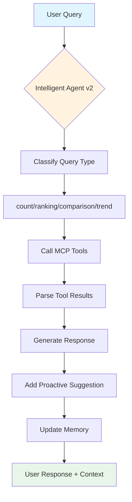

# FleetIntel Agente Inteligente - Design Document

## 🎯 Visão do Usuário

> "Quero um agente especialista nessa base que compreenda o conteúdo de forma inteligente, converse naturalmente, seja proativo, conheça a base e o usuário, aprenda com cada uso e não seja puramente respondedor de perguntas."

---

## 📊 Análise do Problema Atual

### Problemas Identificados

| # | Problema | Impacto | Causa Raiz |
|---|----------|---------|------------|
| 1 | "Consulta processada com sucesso" | Agent não responde efetivamente | `format_tool_response` procura chave `text` que não existe |
| 2 | Sem personalidade | Conversa robotica | System prompt básico sem persona |
| 3 | Sem memória | Não aprende com interações | Cada query começa do zero |
| 4 | Sem contexto do usuário | Respostas genéricas | Não sabe quem está perguntando |
| 5 | Sem proatividade | Apenas responde | Nunca sugere insights |
| 6 | Schemaless | Não conhece a base | Não sabe tabelas/relacionamentos |

### Fluxo Atual Problemático

```
User: "quantos caminhoes a addiante comprou em 2025?"
    ↓
Agent: Chama top_empresas_by_registrations(ano=2025)
    ↓
MCP: Retorna {"empresas": [...], "count": 5, "query": "...", "timestamp": "..."}
    ↓
format_tool_response(): output_text = "" (não achou chave "text")
    ↓
Retorna: "Consulta processada com sucesso." ❌
```

---

## 🏗️ Arquitetura Proposta: FleetIntel Agent v2

### Componentes do Sistema

```
┌─────────────────────────────────────────────────────────────────┐
│                    FLEETINTEL AGENT v2                          │
├─────────────────────────────────────────────────────────────────┤
│  ┌─────────────────────────────────────────────────────────┐   │
│  │                    INTELLIGENT CORE                     │   │
│  │  ┌─────────────┐ ┌─────────────┐ ┌─────────────────┐    │   │
│  │  │   Persona  │ │  Memory     │ │ Context Engine  │    │   │
│  │  │   Engine   │ │   System    │ │                 │    │   │
│  │  └─────────────┘ └─────────────┘ └─────────────────┘    │   │
│  └─────────────────────────────────────────────────────────┘ │
│  ┌─────────────────────────────────────────────────────────┐   │
│  │                     LLM LAYER                            │   │
│  │  ┌─────────────────────────────────────────────────┐    │   │
│  │  │  Enhanced System Prompt + Schema + Examples     │    │   │
│  │  └─────────────────────────────────────────────────┘    │   │
│  └─────────────────────────────────────────────────────────┘ │
│  ┌─────────────────────────────────────────────────────────┐   │
│  │                    TOOLS LAYER                           │   │
│  │  ┌───────────┐ ┌───────────┐ ┌───────────────────┐       │   │
│  │  │  MCP      │ │ Insight  │ │ Proactive        │       │   │
│  │  │  Tools    │ │ Engine   │ │ Suggestions      │       │   │
│  │  └───────────┘ └───────────┘ └───────────────────┘       │   │
│  └─────────────────────────────────────────────────────────┘ │
└─────────────────────────────────────────────────────────────────┘
```

---

## 🎨 Componentes Detalhados

### 1. Enhanced System Prompt

```python
SYSTEM_PROMPT_V2 = """Você é o **FleetIntel Assistant**, um especialista em dados de frota veicular do Brasil.

## Sua Identidade

Você é um assistente profissional, analítico e proativo. Você tem acesso a um banco de dados completo com informações de emplacamentos de veículos pesados (caminhões, ônibus, vans) de todo o Brasil.

## O Que Você Conhece

### Schema do Banco de Dados
- **vehicles**: 986,859 veículos cadastrados
  - chassi (VIN), placa, marca, modelo, ano_fabricacao, ano_modelo
- **registrations**: 919,941 registros de emplacamento
  - data_emplacamento, municipio, UF, preco, vehicle_id, empresa_id
- **empresas**: 161,932 empresas/locadoras
  - cnpj, razao_social, nome_fantasia, segmento_cliente, grupo_locadora
- **marcas**: 19 marcas (Volkswagen, Mercedes-Benz, Volvo, etc.)
- **modelos**: 1,886 modelos de veículos

### Relacionamentos
- Cada registration pertence a 1 vehicle e 1 empresa
- Vehicles pertencem a 1 marca e 1 modelo
- Empresas podem ter múltiplos emplacamentos

## Suas Capacidades

1. **Análise de Mercado**: Identificar tendências, líderes de mercado, segmentos em crescimento
2. **Inteligência Competitiva**: Comparar empresas, marcas, estados
3. **Insights Proativos**: Oferecer análises relevantes baseadas nas perguntas
4. **Conversa Natural**: Responder de forma clara, com contexto e profundidade

## Como Responder

- Para **perguntas simples**: Responda diretamente com os números
- Para **análises**: Estruture com contexto, dados e insights
- Para **sugestões**: Ofereça follow-up questions relevantes
- Para **erros**: Explique claramente o que aconteceu e sugira alternatives

## Exemplos de Conversa

**User**: "qual empresa mais emplacou em 2025?"
**You**: "Em 2025, a **[Adiante] liderou** com **X veículos emplacados**. 

Ela representa Y% do total. 

Quer ver o ranking completo ou analisar por estado?"

**User**: "quantos caminhoes tem no banco?"
**You**: "O banco tem **986,859 veículos** registrados, sendo:
- **X% caminhoes** (>6t)
- **Y% onibus**
- **Z% vans**

Quer filtrar por marca, ano ou estado?"
"""
```

### 2. Memory System

```python
class AgentMemory:
    """Sistema de memória para o agente."""
    
    def __init__(self, user_id: str):
        self.user_id = user_id
        self.conversation_history: list[Message] = []
        self.user_preferences: dict = {}
        self.learned_facts: list[str] = []
        self.query_patterns: dict = {}
    
    def add_message(self, role: str, content: str):
        """Adiciona mensagem ao histórico."""
        self.conversation_history.append({
            "role": role,
            "content": content,
            "timestamp": datetime.utcnow().isoformat()
        })
    
    def remember_fact(self, fact: str):
        """Aprende um fato sobre o usuário ou preferências."""
        if fact not in self.learned_facts:
            self.learned_facts.append(fact)
    
    def get_context(self) -> str:
        """Retorna contexto para o prompt."""
        context_parts = []
        
        if self.learned_facts:
            context_parts.append(f"Conhecimentos prévios: {'; '.join(self.learned_facts)}")
        
        if self.user_preferences:
            prefs = [f"{k}: {v}" for k, v in self.user_preferences.items()]
            context_parts.append(f"Preferências: {', '.join(prefs)}")
        
        if self.conversation_history:
            last_queries = [m["content"][:100] for m in self.conversation_history[-5:]]
            context_parts.append(f"Últimas conversas: {'; '.join(last_queries)}")
        
        return "\n".join(context_parts) if context_parts else ""
```

### 3. Intelligent Response Generator

```python
async def generate_intelligent_response(
    query: str,
    tool_results: dict,
    memory: AgentMemory,
    user_context: dict
) -> str:
    """Gera resposta inteligente com contexto e insights."""
    
    # Analisar tipo de pergunta
    query_type = classify_query(query)
    
    if query_type == "count":
        return format_count_response(query, tool_results)
    elif query_type == "ranking":
        return format_ranking_response(query, tool_results)
    elif query_type == "comparison":
        return format_comparison_response(query, tool_results)
    elif query_type == "trend":
        return format_trend_response(query, tool_results)
    else:
        return format_general_response(query, tool_results)


def format_count_response(query: str, results: dict) -> str:
    """Formata resposta para perguntas de contagem."""
    count = results.get("count", results.get("total", 0))
    
    # Extrair número da query original
    match = re.search(r'\d+', query)
    entity = extract_entity(query)  # "caminhões", "veículos", "emplacamentos"
    
    return f"""📊 **Resultado**

Encontrei **{count:,} {entity}**{' no banco de dados' if not 'no banco' in query.lower() else ''}.

Isso representa {calculate_percentage(count, TOTAL_VEHICLES)}% do total de veículos cadastrados.

Quer filtrar por algum critério específico?"""
```

### 4. Enhanced Tools (MCP v2)

```python
# Novas ferramentas mais inteligentes

async def analyze_registrations_by_period(
    data_inicio: str,
    data_fim: str,
    group_by: str = "mes",  # "mes", "marca", "uf", "empresa"
    include_insights: bool = True
) -> dict:
    """Analisa registros por período com insights."""
    
    # Query com grouping
    query = text(f"""
        SELECT 
            {group_by_field(group_by)} as group_value,
            COUNT(*) as count,
            SUM(preco) as total_value,
            AVG(preco) as avg_price
        FROM registrations r
        WHERE r.data_emplacamento BETWEEN :inicio AND :fim
        GROUP BY {group_by_field(group_by)}
        ORDER BY count DESC
    """)
    
    results = await session.execute(query, {"inicio": data_inicio, "fim": data_fim})
    
    if include_insights:
        insights = generate_insights(results)
    else:
        insights = []
    
    return {
        "data": [{"group": r[0], "count": r[1], "total": r[2], "avg": r[3]} for r in results],
        "insights": insights,
        "summary": {
            "total": sum(r[1] for r in results),
            "top_group": results[0] if results else None
        }
    }
```

### 5. Proactive Suggestions Engine

```python
class ProactiveEngine:
    """Motor de sugestões proativas."""
    
    SUGGESTION_TEMPLATES = {
        "count_high": [
            "Esse número é bem alto! Quer ver o ranking por estado?",
            "Interessante! {entity} representa {pct}% do total. Quer analisar por marca?",
        ],
        "count_low": [
            "Número relativamente baixo. Quer comparar com outros anos?",
            "Posso filtrar por estado ou marca para encontrar mais opções.",
        ],
        "ranking_top": [
            "A líder do mercado! Quer ver a evolução dela nos últimos anos?",
            "Quer saber o que fez eles liderarem?",
        ],
        "trend_up": [
            "Crescimento expressivo! Quer ver quais modelos mais contribuíram?",
            "Posso detalhar por estado para ver onde esse crescimento foi mais forte.",
        ],
    }
    
    def generate_suggestion(self, query_type: str, data: dict) -> str:
        """Gera sugestão proativa baseada nos dados."""
        template = random.choice(self.SUGGESTION_TEMPLATES.get(query_type, []))
        return template.format(**data)
```

---

## 📋 Plano de Implementação

### Fase 1: Correções Críticas (IMEDIATO)

| # | Tarefa | Arquivo | Prioridade |
|---|--------|---------|------------|
| 1 | Corrigir `format_tool_response` | `agent/agent.py` | 🔴 Alta |
| 2 | Melhorar parsing de tool results | `agent/agent.py` | 🔴 Alta |
| 3 | Adicionar Enhanced System Prompt | `agent/agent.py` | 🔴 Alta |

### Fase 2: Inteligência Básica

| # | Tarefa | Arquivo | Prioridade |
|---|--------|---------|------------|
| 4 | Criar sistema de memória | `agent/memory.py` | 🟡 Média |
| 5 | Classificador de queries | `agent/query_classifier.py` | 🟡 Média |
| 6 | Response generators por tipo | `agent/responses.py` | 🟡 Média |

### Fase 3: Recursos Avançados

| # | Tarefa | Arquivo | Prioridade |
|---|--------|---------|------------|
| 7 | Proactive suggestions | `agent/proactive.py` | 🟢 Baixa |
| 8 | MCP tools v2 | `mcp_server/v2_tools.py` | 🟢 Baixa |
| 9 | User context awareness | `agent/user_context.py` | 🟢 Baixa |

---

## 🔧 Correção Imediata: format_tool_response

```python
def format_tool_response(tool_outputs: list) -> str:
    """Formata a resposta baseada nas saidas das ferramentas."""
    if not tool_outputs:
        return "Nao foi possivel processar sua consulta. Tente reformular a pergunta."
    
    answers = []
    for output in tool_outputs:
        if isinstance(output, dict):
            # MCP retorna: {"vehicles": [...], "count": 10, "query": "..."}
            if "count" in output and "query" in output:
                # É uma resposta de contagem
                count = output.get("count", 0)
                query_type = output.get("query", "")
                answers.append(_format_count_response(count, query_type))
            elif "vehicles" in output:
                vehicles = output.get("vehicles", [])
                answers.append(_format_vehicles_response(vehicles))
            elif "empresas" in output:
                empresas = output.get("empresas", [])
                answers.append(_format_empresas_response(empresas))
            elif "registrations" in output:
                regs = output.get("registrations", [])
                answers.append(_format_registrations_response(regs))
            elif "stats" in output:
                answers.append(_format_stats_response(output.get("stats", {})))
            elif "text" in output:
                answers.append(output["text"])
        elif isinstance(output, str):
            answers.append(output)
    
    return "\n".join(answers).strip() if answers else "Consulta processada com sucesso."


def _format_count_response(count: int, query_type: str) -> str:
    """Formata resposta de contagem."""
    if count == 0:
        return "Nenhum resultado encontrado para essa consulta."
    
    entity = {
        "search_vehicles": "veículo        "search_empresas": "empresa",
        "",
search_registrations": "emplacamento",
        "top_empresas_by_registrations": "empresa no ranking",
    }.get(query_type, "resultado")
    
    return f"Encontrei **{count:,} {entity}s**."


def _format_vehicles_response(vehicles: list) -> str:
    """Formata resposta de veículos."""
    if not vehicles:
        return "Nenhum veículo encontrado."
    
    count = len(vehicles)
    preview = vehicles[:3]
    
    lines = [f"📋 **{count} veículos encontrados:**"]
    for v in preview:
        lines.append(f"  • {v.get('marca', 'N/A')} {v.get('modelo', 'N/A')} ({v.get('ano_fabricacao', 'N/A')}) - {v.get('placa', 'N/A')}")
    
    if count > 3:
        lines.append(f"  ... e mais {count - 3} veículos")
    
    return "\n".join(lines)


def _format_empresas_response(empresas: list) -> str:
    """Formata resposta de empresas."""
    if not empresas:
        return "Nenhuma empresa encontrada."
    
    count = len(empresas)
    preview = empresas[:5]
    
    lines = [f"🏢 **{count} empresas encontradas:**"]
    for e in preview:
        nome = e.get('nome_fantasia') or e.get('razao_social', 'N/A')
        segmento = e.get('segmento_cliente', '')
        lines.append(f"  • {nome} ({segmento})")
    
    if count > 5:
        lines.append(f"  ... e mais {count - 5} empresas")
    
    return "\n".join(lines)


def _format_stats_response(stats: dict) -> str:
    """Formata estatísticas do banco."""
    lines = ["📊 **Estatísticas do Banco de Dados:**"]
    for key, value in stats.items():
        lines.append(f"  • {key.title()}: {value:,}")
    return "\n".join(lines)
```

---

## 🧪 Teste de Validação

```python
async def test_agent_response():
    """Testa se o agente responde corretamente."""
    
    # Simular tool result do MCP
    tool_result = {
        "empresas": [
            {"razao_social": "Adiante Locadora de Veiculos", 
             "total_registrations": 15000, 
             "segmento": "Locadora"},
        ],
        "count": 1,
        "query": "top_empresas_by_registrations",
    }
    
    # Testar format_tool_response
    output = format_tool_response([tool_result])
    
    expected = "🏢 **1 empresa no ranking:**\n  • Adiante Locadora de Veiculos (Locadora)"
    
    assert expected in output, f"Expected: {expected}\nGot: {output}"
    print("✅ Teste passou!")
```

---

## 📊 Diagrama de Fluxo Proposto



---

## ✅ Checklist de Validação

- [ ] Agent responde "X veículos encontrados" em vez de "Consulta processada"
- [ ] Agent oferece sugestões proativas
- [ ] Agent mantém contexto da conversa
- [ ] Agent conhece schema do banco
- [ ] Agent tem personalidade definida
- [ ] Agent aprende com interações

---

## ⏭️ Próximos Passos

1. **IMEDIATO**: Corrigir `format_tool_response` para retornar dados reais
2. **CURTO**: Implementar Enhanced System Prompt
3. **MÉDIO**: Adicionar Memory System
4. **LONGO**: Proactive Suggestions Engine
