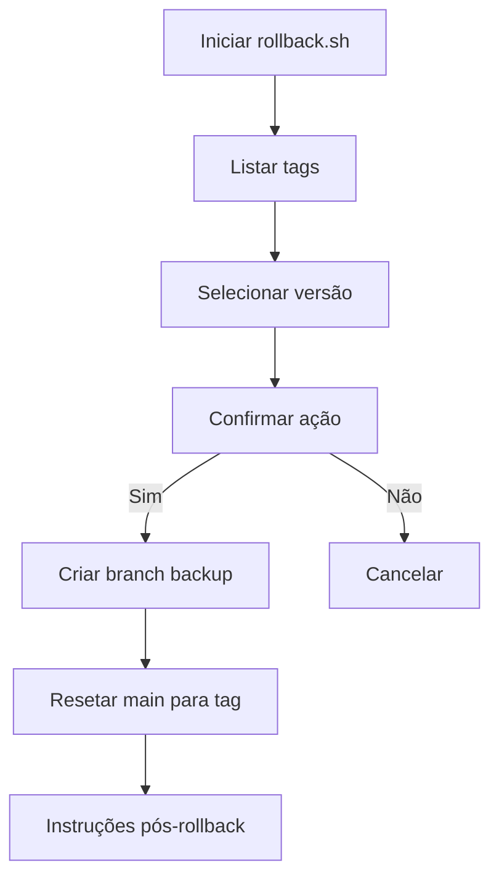

# Guia de Rollback - FleetIntel MCP

## Configuração Inicial

### Para usuários Windows
O script requer permissões de execução que devem ser configuradas no Git Bash:

1. Abra o Git Bash como administrador
2. Navegue até o diretório do projeto:
```bash
cd /c/Users/'Pc Gamer'/Desktop
```
3. Torne o script executável:
```bash
chmod +x scripts/rollback.sh
```

## Uso do Script de Rollback

### Pré-requisitos
- Git instalado
- Acesso ao repositório
- Permissões para criar branches e force push

### Passos para Rollback

1. Executar o script:
```bash
./scripts/rollback.sh
```

2. Seguir as instruções interativas:
   - Selecionar versão da lista de tags
   - Confirmar ação

3. O script criará um branch de backup e reverterá o main para a tag selecionada

4. Realizar force push (com cuidado) e redeploy:
```bash
git push --force origin main
```

### Fluxo Completo


### Notas Importantes
- Rollback altera o histórico - use com cuidado
- Sempre teste em staging antes de produção
- Documente o rollback no ticket relacionado
