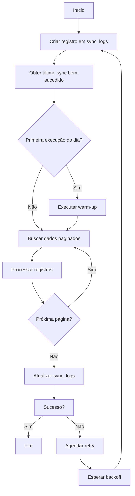

# Estratégia de Sincronização Incremental Semanal

## Janela de Busca
- **Período**: 7 dias + 1 dia de overlap (total 8 dias)
- **Horário de execução**: Domingo 22h (horário de Brasília)
- **Overlap**: Garante que atualizações no dia anterior não sejam perdidas

## Estratégia de Checkpoint
1. Armazenar último sync bem-sucedido na tabela `sync_logs`
2. Em caso de falha, retomar a partir do último checkpoint válido
3. Persistir estado mesmo em reinicializações do sistema

## Warm-up da API
- **Primeira chamada do dia**: Timeout estendido (60s)
- **Request simples**: `GET /?top=1`
- **Benefícios**: Evita penalidades de cold start na API externa

## Fluxo de Sincronização

## Tratamento de Falhas
- **Retry automático**: 3 tentativas com backoff exponencial (2^n minutos)
- **Fallback**: Notificar equipe após falhas consecutivas
- **Log detalhado**: Registrar erro e contexto no Supabase

## Critérios de Sucesso
1. 100% dos registros da janela processados
2. Tempo total de execução < 60 minutos
3. Discrepância 0 entre registros buscados e inseridos
4. Status 'success' registrado em `sync_logs`

## Monitoramento e Alertas
- **Métricas-chave**:
  - Duração total
  - Registros por segundo
  - Taxa de falhas
- **Alertas**:
  - Status 'failed' em sync_logs
  - Duração > 45 minutos
  - Discrepância > 1% nos registros
- **Dashboard**: Grafana com histórico de execuções
